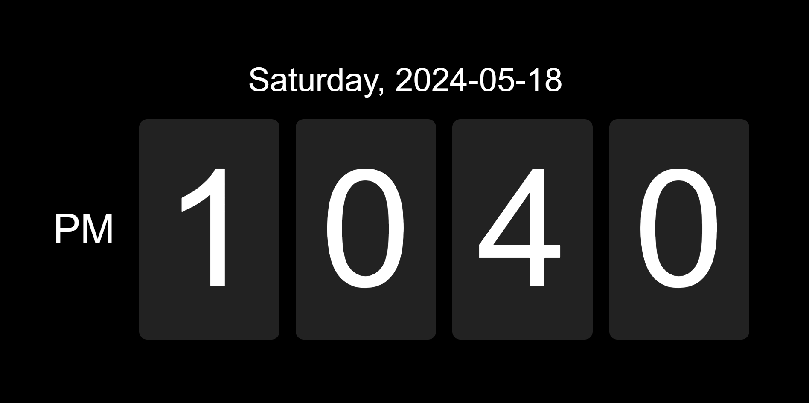

**Mac OS Clock**

**Description:**
This repository contains a simple clock website developed using HTML, CSS, and JavaScript. The website displays the current time in a user-friendly interface and provides basic functionalities such as time updating and customization options.

**Features:**
- Displays the current time in a clean and intuitive interface.
- Updates the time in real-time.

**Getting Started:**
To run the clock website on your system, follow these steps:
1. Go to below link and Done
   
   ```bash
   https://rahultanwarclock.netlify.app/
   ```

**Usage:**
- Upon opening the website, the current time will be displayed.
- Customize the display settings by modifying the CSS file.
- Enjoy the simple and elegant interface of the clock website.

**Contributing:**
Contributions are welcome! If you'd like to contribute to this project, feel free to fork the repository and submit a pull request with your changes.


**Acknowledgments:**
- Inspired by the minimalistic design of clock websites.
- Special thanks to the web development community for their valuable resources and support.

**Demo:**


**Note:**
This website is developed for educational purposes and may not be suitable for production environments.
